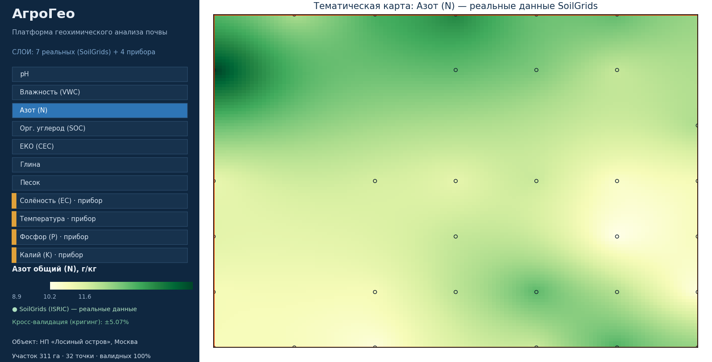
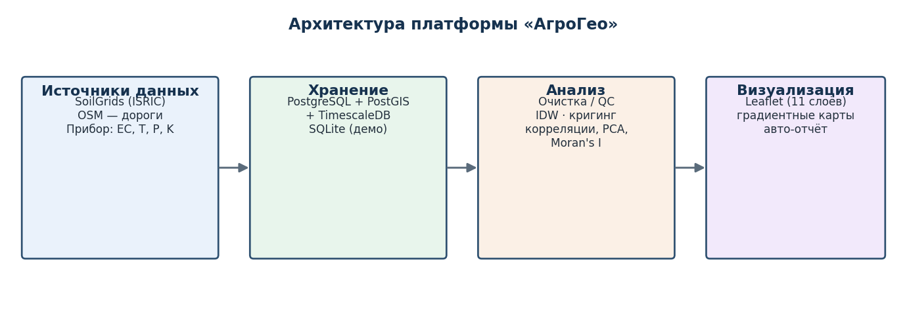
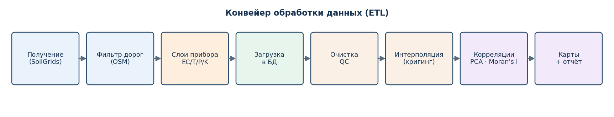

# GeoHim Analyze Platform · «АгроГео»

Программная платформа **сбора, хранения, анализа и визуализации геохимических данных почвы** —
программная часть мобильного автоматизированного робототехнического комплекса для агрохимического
анализа (НИОКР по программе «УМНИК», договор 17098ГУ/2021).

Платформа отрабатывается на **реальных** открытых данных о свойствах почвы (**SoilGrids / ISRIC**)
по участку Национального парка **«Лосиный остров»** (Москва) и дополняется слоями, которые
измеряет прибор комплекса (EC, температура, доступные P и K) — их нет в открытых источниках.

> 🌐 **Демо (GitHub Pages):** включается через *Settings → Pages → Deploy from a branch →
> ветка `main`, папка `/docs`*. Сайт самодостаточен (данные встроены в `docs/layers_data.js`).



## Архитектура





## Возможности

- **Хранение** — пространственно‑временная схема: PostgreSQL 16 + PostGIS 3.4 + TimescaleDB
  (продакшен, `db/schema_postgres.sql`) и встроенный SQLite для автономной демо‑сборки.
- **Получение реальных данных** — клиент SoilGrids (ISRIC) по сетке точек; берутся только точки
  с реальными значениями; придорожные точки исключаются по данным OSM (Overpass).
- **Анализ** — очистка/QC, пространственная интерполяция (IDW и **ординарный кригинг**),
  перекрёстная проверка (leave‑one‑out), корреляции Пирсона/Спирмена, **PCA**, **Moran's I**.
- **Визуализация** — интерактивная веб‑карта на **Leaflet**: 11 тематических слоёв
  (7 реальных + 4 от прибора), градиентные карты, дороги OSM, просмотр значений в точке, легенда.
- **Авто‑отчёт** по полю (`output/field_report.html`) с картами, метриками и корреляциями.

## Метрики (слои)

| Реальные (SoilGrids) | Прибор комплекса (нет в открытых данных) |
|---|---|
| pH · влажность (VWC) · азот общий (N) · орг. углерод (SOC) · ЕКО (CEC) · глина · песок | EC (солёность) · температура · доступный P · доступный K |

## Быстрый старт

```bash
pip install -r requirements.txt
cd src
python run_all.py                 # данные SoilGrids -> хранилище -> анализ -> слои (несколько минут)
python run_all.py --skip-fetch    # если data/raw_measurements.csv уже получен
```

Откройте `docs/index.html` (нужен интернет для подложки OpenStreetMap) или
`python -m http.server --directory docs`.

## Структура

```
geohim_analyze_platform/
├─ src/            конвейер (config, fetch_real_data, filter_roads, add_device_metrics, storage, analyze, run_all)
├─ docs/           интерактивная веб‑карта (index.html, app.js, style.css, layers_data.js) — публикуется в GitHub Pages
├─ db/             schema_postgres.sql (PostGIS + TimescaleDB)
├─ data/           реальные данные SoilGrids и геометрия (CSV, GeoJSON)
├─ assets/         иллюстрации для README
├─ output/         генерируемые артефакты (БД, слои, отчёт) — не версионируется
└─ requirements.txt
```

## Соответствие календарному плану (Этап 2)

| Работа КП | Реализация |
|---|---|
| 1. Хранение геоданных | `db/schema_postgres.sql`, `src/storage.py` |
| 2. Анализ больших данных | `src/analyze.py` (IDW/кригинг, кросс‑валидация) |
| 3. Исследование визуализации | обзор средств → выбор Leaflet |
| 4. Система визуализации | `docs/` (11 слоёв) |
| 5. Корреляции метрик | `src/analyze.py` (Пирсон/Спирмен, PCA, Moran's I) |
| 6. Полевое тестирование | прогон по участку «Лосиный остров» + авто‑отчёт |

## Данные и достоверность

Фоновые слои — реальные данные **SoilGrids (ISRIC)**, лицензия CC‑BY 4.0; подложка —
**OpenStreetMap** (ODbL); дороги — OSM/Overpass. Слои прибора (EC, T, P, K) в демо‑сборке
синтезированы правдоподобно и явно помечены как измеряемые прибором — в продакшене они
поступают с датчика комплекса. Все аналитические показатели вычисляются из данных.

## Лицензия

MIT — см. [LICENSE](LICENSE).
